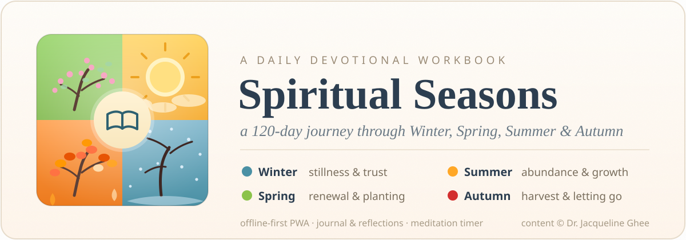
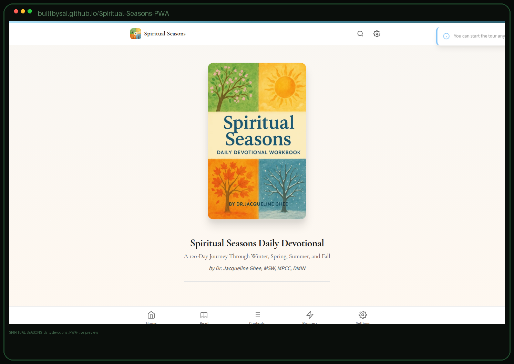

# Spiritual Seasons — Daily Devotional PWA





A 120-day devotional journey through Winter, Spring, Summer, and Autumn, presented as an offline-first progressive web app.

**Live app:** [builtbysai.github.io/Spiritual-Seasons-PWA](https://builtbysai.github.io/Spiritual-Seasons-PWA/)

Devotional content by Dr. Jacqueline Ghee, MSW, MPCC, DMIN. App built by Hans Sai.

## What's inside

- **120 daily devotionals** across four themed seasons — Winter (stillness and trust), Spring (renewal and planting), Summer (abundance and growth), Autumn (harvest and letting go)
- **Season quizzes** to reflect on each leg of the journey
- **Personal journal** with favorites, weekly reflections, and reading streaks
- **Practice tools:** meditation timer, guided breathing, ambient sounds
- **Listen along:** text-to-speech readings and audio notes
- **Progress tracking** with calendar integration
- **Full-text search** across all devotional content
- **Export** your journal and reflections to PDF or data files
- **Offline-first:** the full app works without a connection once installed; installable on phone and desktop
- Themes, keyboard shortcuts, page transitions, and an onboarding tour

## Privacy

Everything personal stays on your device. Journal entries, progress, favorites, settings, and audio notes live in the browser's IndexedDB — there is no account and no server collecting your data.

## Run locally

Any static file server works — there is no build step:

```bash
npx serve .
# or
python3 -m http.server 8000
```

---

*Devotional content © Dr. Jacqueline Ghee. App built by [Hans Sai](https://builtbysai.com).*
